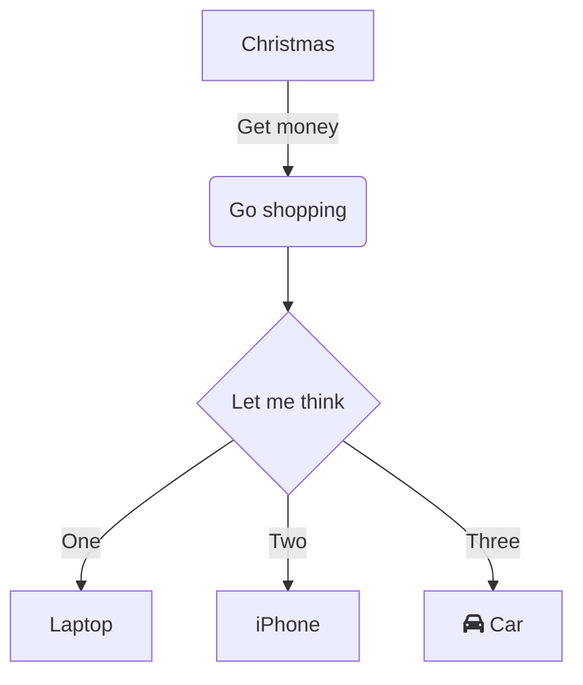

# fnirslib

Library to process and analyze fnirs data

author @nimrobotics [](https://twitter.com/intent/follow?screen_name=nimrobotics)


## Installation


```bash
git clone https://github.com/nimRobotics/fnirslib
pip install ./fnirslib
cd fnirslib
pip install -r requirements.txt
```

Uninstall: `pip uninstall fnirslib`

## Usage

See the [examples](examples) directory for usage examples.

## License

MIT License

## Pipeline


